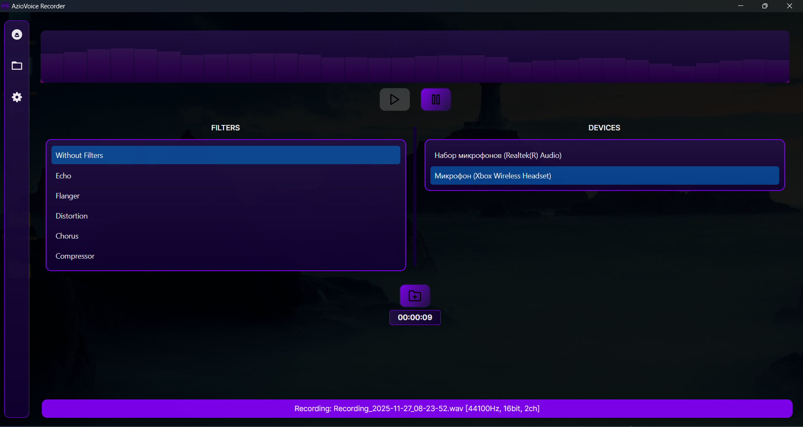
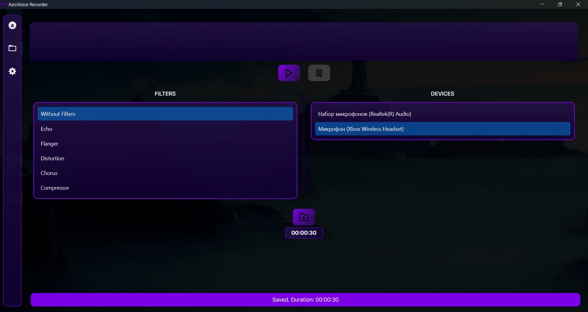
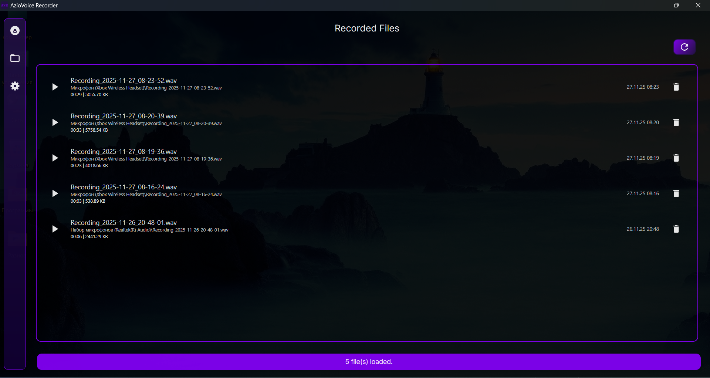
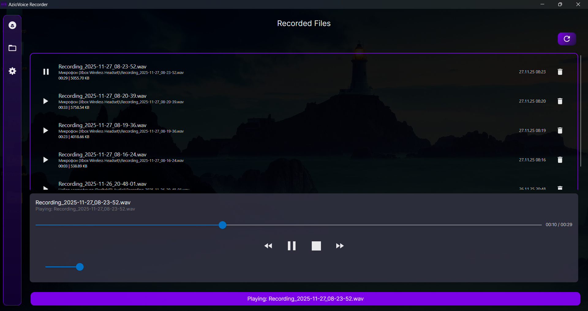
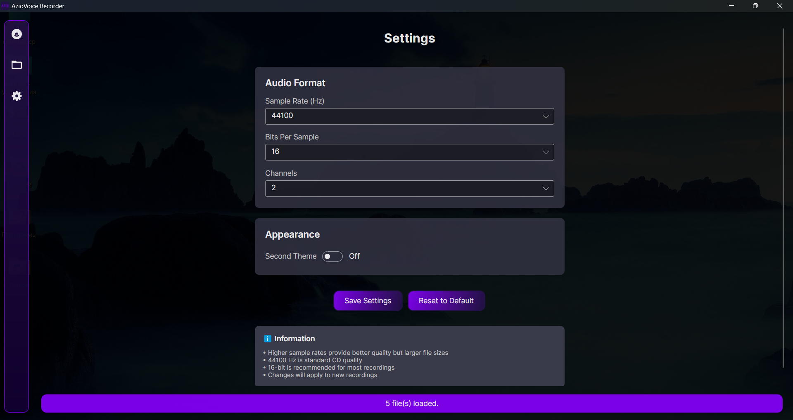
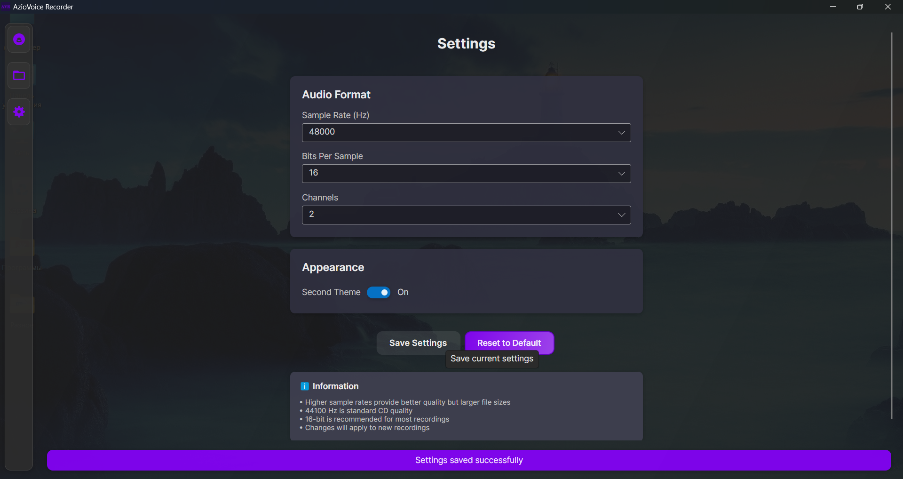
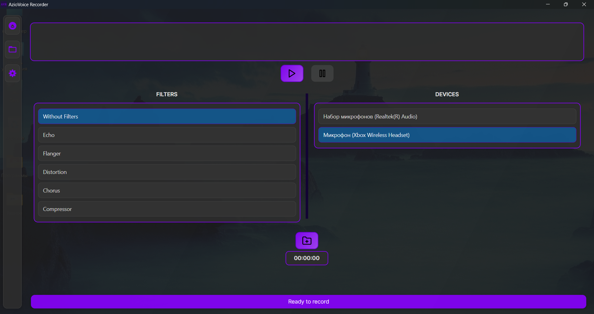
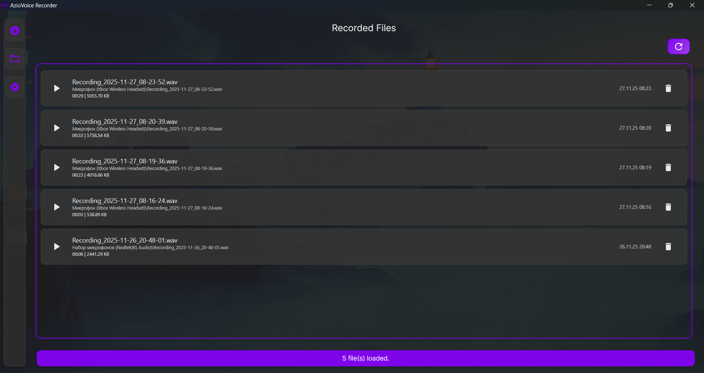

# AzioVoice Recorder

## Description

AzioVoice Recorder is a modern application for Windows that provides audio recording capabilities with advanced audio filtering. Built with Avalonia UI and CSCore, it offers an intuitive interface for capturing high-quality audio recordings.

### Core Functionality
* **Multi-Device Support:** Record from any available audio input device
* **High-Quality Recording:** WAV format output with configurable audio settings
* **File Management:** Browse, play, and delete recordings with metadata display
* **Customizable Settings:** Configure sample rate, bit depth, and channel count

### Audio Filters
Choose from multiple professional-grade audio filters:

* **Echo:** Add depth and ambiance to recordings
* **Flanger:** Create sweeping, whooshing effects
* **Distortion:** Add grit and saturation
* **Chorus:** Enrich recordings with layered sounds
* **Compressor:** Balance audio levels dynamically
* **No Filter:** Pure, unprocessed audio capture

### User Interface
* **Dual Theme Support:** Switch between Main (dark) and Second (light) themes
* **Persistent Theme Settings:** Your theme preference is automatically saved
* **Status Bar:** Clear feedback for all operations
* **Intuitive Navigation:** Quick access to Recording, Files, and Settings

### File Explorer
* **Detailed File Information:** Name, duration, size, date, and location
* **Quick Actions:** Play, delete, and open files with system default apps
* **Organized Storage:** Automatic folder structure in `Documents/AzioVoiceRecorder`

### Settings
* **Audio Format Configuration:**
    - Sample Rate: 8-192 kHz (default: 44.1 kHz CD quality)
    - Bit Depth: 8, 16, 24, or 32 bits (default: 16-bit)
    - Channels: Mono or Stereo (default: Stereo)
* **Theme Selection:** Toggle between main and second themes with instant preview
* **Persistent Storage:** Settings are saved to `%APPDATA%\AzioVoiceRecorder\settings.json`

## System Requirements
* **Operating System:** Windows 11 (x64)
* **Runtime:** .NET 9.0
* **Memory:** 2GB RAM minimum
* **Storage:** 100MB available space
* **Audio:** Compatible audio input device (microphone)
* **Permissions:** Microphone access (configure in Windows Privacy Settings)

## Usage

### Recording Audio
1. Select the device you want to record from the list
2. Choose from available filters to enhance your audio OR select "Without Filters" if you don't want to use any filters
3. Click the "Start Recording" button to begin recording
4. Click the "Stop Recording" button to stop recording - the file will be saved automatically
5. Monitor recording status in the status bar at the bottom

### Browsing Files
1. Click the Files icon to view all your recordings
2. Use playback controls to listen to recordings
3. Delete unwanted files
4. View detailed metadata for each recording

### Managing Settings
1. Click the Settings icon in the navigation panel
2. Adjust audio format settings (sample rate, bit depth, channels) as needed
3. Toggle between light and dark themes using the switch
4. Click "Save Settings" to apply changes to future recordings
5. Use "Reset to Default" to restore factory settings

## Contributing

Pull requests are welcome. For major changes, please open an issue first to discuss what you would like to change.

## Author

Bohdan Harabadzhyu

## License

This project is licensed under the MIT License - see the [LICENSE](LICENSE) file for details.

## SourceForge

## YouTube Review

📺 Watch Video Review

