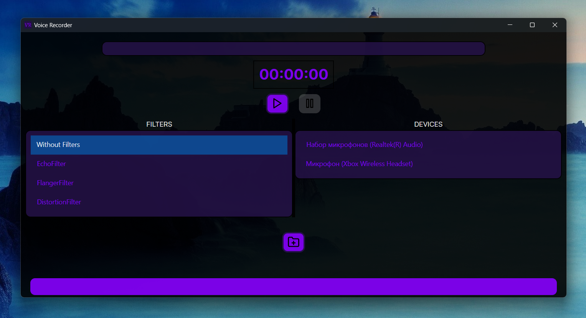

# VoiceRecorder

## Description

VoiceRecorder is an user-friendly application designed to record audio from selected devices. It's perfect for quick recordings and  audio testing.

## Installation

To install the VoiceRecorder application, download the VoiceRecorder.rar. Extract the .rar file, and run the VoiceRecorder.exe file on your machine.

## Usage

1. Select the device you want to record from the list.
2. Choose from three available filters to enhance your audio OR choose Without Filters field if you don't want to use any filters.
3. Click the "Start Recording" button to begin recording.
4. Click the "Stop Recording" button to stop recording. The recording will be saved automatically.
5. The status of the recording is displayed in the application.

## Contributing

Pull requests are welcome. For major changes, please open an issue first to discuss what you would like to change.

## Author

Bohdan Harabadzhyu

## License

[MIT](https://choosealicense.com/licenses/mit/)

## SourceForge

