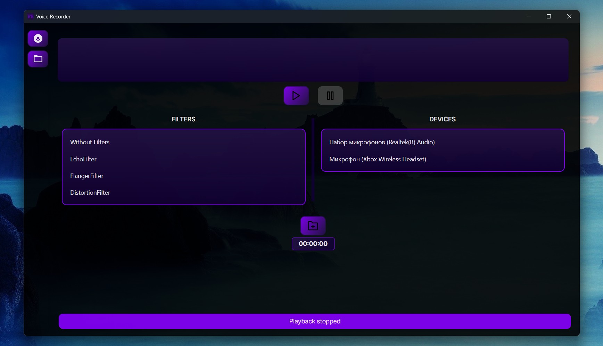
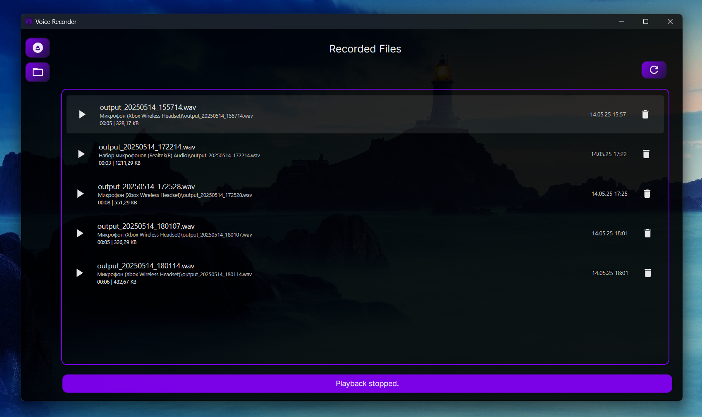

# VoiceRecorder

## Description

VoiceRecorder is a modern application for Windows that provides audio recording capabilities with advanced audio filtering. Built with Avalonia UI and CSCore, it offers an intuitive interface for capturing high-quality audio recordings.

### Core Functionality
* **Multi-Device Support:** Record from any available audio input device
* **High-Quality Recording:** WAV format output with configurable audio settings
* **File Management:** Browse, play, and delete recordings with metadata display

### Audio Filters
Choose from multiple professional-grade audio filters:

* **Echo:** Add depth and ambiance to recordings
* **Flanger:** Create sweeping, whooshing effects
* **Distortion:** Add grit and saturation
* **Chorus:** Enrich recordings with layered sounds
* **Compressor:** Balance audio levels dynamically
* **No Filter:** Pure, unprocessed audio capture

### User Interface
* **Dual Theme Support:** Switch between Main (purple gradient) and Second themes
* **Status Bar:** Clear feedback for all operations

### File Explorer
* **Detailed File Information:** Name, duration, size, date, and location
* **Quick Actions:** Play, delete, and open files with system default apps
* **Organized Storage:** Automatic folder structure in `Documents/VoiceRecorder`

---

## System Requirements
* **Operating System:** Windows 11 (x64)
* **Runtime:** .NET 9.0
* **Memory:** 2GB RAM minimum
* **Storage:** 100MB available space
* **Audio:** Compatible audio input device (microphone)
* **Permissions:** Microphone access (configure in Windows Privacy Settings)

---

## Usage

1. Select the device you want to record from the list.
2. Choose from three available filters to enhance your audio OR choose Without Filters field if you don't want to use any filters.
3. Click the "Start Recording" button to begin recording.
4. Click the "Stop Recording" button to stop recording. The recording will be saved automatically.
5. The status of the recording is displayed in the application.

## Contributing

Pull requests are welcome. For major changes, please open an issue first to discuss what you would like to change.

## Author

Bohdan Harabadzhyu

## License

This project is licensed under the MIT License - see the [LICENSE](LICENSE) file for details.
## SourceForge

## YouTube Review

📺 Watch Video Review

